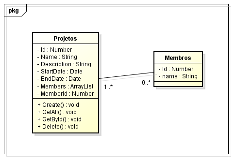

# Project management - Technical challenge

By: Enick Jhony

### Premissas:

- O front vai iniciar na rota `/` que vai me trazer um `GetAll` de todos registros criados
- Ainda na rota `/` vai ter uma área de navegação direcionando para a home e para cadastro de um novo projeto
- Na rota `/project` vai ter um form para cadastrar novos projetos
- Voltando para a `home` terá uma lista com os projetos que foram posteriormente cadastrados
- E ao lado de cada um dos projetos terá um botão para deletar o projeto
- Esse botão vai chamar o backend mandando o metodo `DELETE` junto com o ID do projeto

### Pré requisitos - dependências globais

Você precisa ter duas principais dependências instaladas:

- Node.js LTS v18 (ou qualquer versão superior)
- Docker Engine v17.12.0 com Docker Compose v1.24.1 (ou qualquer versão superior)

### Dependências locais

Com o repositório clonado e as dependências globais instaladas, você pode instalar as dependências locais do projeto:

Abra com o terminal a pasta `proj-manag-api` e utilize os seguintes comandos

```bash
npm install
```

```bash
docker compose up -d
```

```bash
npx prisma migrate dev --name init
```

```bash
npm run seed
```

```bash
npm run start:dev
```

Em outro terminal acesse a pasta `proj-manag-front` e utilize o seguinte comando

```bash
npm run dev
```

Esses comandos vão instalar o projeto localmente, rodar o docker com o serviço do bando de dados, criar a migração do banco de dados, expor os serviços do backend e frontend nos endereços:

```bash
http://localhost:3000/
http://localhost:4200/
```

### Steps (Development):

<details>

<summary>click to see more</summary>

Back end

- [x] Definição do Back-End
- [x] Implantação do Model da aplicação
- [x] Implantação do Docker juntamente com imagem do PostgreSQL
- [x] Implantação do ORM da aplicação (Prisma)
- [x] Implantação das Rotas da aplicação (`/` e `/project`)
- [x] Criar Metodo `POST`
- [x] Criar Metodo `GET ALL`
- [x] Criar Metodo `GET BY ID`
- [x] Criar Metodo `DELETE`
- [x] Criar Seed dos membros iniciais
- [x] Liberar CORS para receber solicitações do Frontend
- [ ] Criar scripts para iniciar o projeto
- [ ] Criar unico scripts para iniciar todo o projeto
- [ ] Configurar corretamente o `.env` e criar `.env.example`
- [ ] Retirar a senha do banco "hardcoded" do `compose.yaml` e `.env`
- [ ] Criar Validação dos campos junto ao banco e backend
- [ ] Criar testes unitários

Front end

- [x] Definição do Front-End com a limpeza inicial
- [x] Criar componente / serviço para listagem dos projetos
- [x] Criar componente / serviço para a criação do projetos
- [x] Criar botão para a deleção dos projetos pelo ID
- [x] Criar rotar `/` e `/project` sendo o `getAll` e a página de cadastro `POST`
- [x] Criar validação dos campos pelo form.
- [ ] Criar componente / serviço para mostrar os detalhes do projetos individualmente
- [x] Estilizar as páginas
- [ ] Resolver problema de renderização da Data na página home (possivelmente problema de timezone)

</details>

### Diagrama de Classe


